# Diagrama de Modelos: User, Store y Branch

Este diagrama muestra las relaciones entre los modelos principales User, Store y Branch y sus modelos derivados.

```mermaid
erDiagram
    %% ============================================
    %% MODELO USER Y SUS RELACIONES
    %% ============================================
    User ||--o{ Account : "tiene"
    User ||--o{ ActionLog : "genera"
    User ||--o{ Store : "posee"
    User ||--o{ Employee : "es"
    User ||--o{ Notification : "recibe"
    User ||--o{ Order : "realiza_como_cliente"
    User ||--o{ Order : "procesa"
    User ||--o{ OrderMessage : "envia"
    User ||--o{ Product : "posee"
    User ||--o{ product_comments : "comenta"
    User ||--o{ product_likes : "da_like"
    User ||--o{ SocialActivity : "genera"
    User ||--o{ StoreReminder : "crea"
    User ||--o{ StoreReminder : "completa"
    User ||--o{ UserReminder : "tiene"
    User ||--o{ UserDeletionLog : "registra"
    User ||--o{ email_change_requests : "solicita"
    User ||--o{ UserFollow : "sigue"
    User ||--o{ UserFollow : "es_seguido_por"
    User ||--o{ Contract : "crea"
    User ||--o{ ContractAssignment : "asigna"

    %% Modelos derivados de User
    Account {
        int id PK
        int user_id FK
        AccountType type
        string suscription_id
        datetime created_at
        datetime updated_at
    }

    UserFollow {
        int id PK
        int follower_id FK
        int following_id FK
        datetime created_at
    }

    UserDeletionLog {
        int id PK
        int user_id FK
        string action
        string reason
        datetime created_at
    }

    UserReminder {
        int id PK
        int user_id FK
        string title
        string description
        datetime due_date
        ReminderPriority priority
        ReminderStatus status
        datetime created_at
        datetime updated_at
    }

    %% ============================================
    %% MODELO STORE Y SUS RELACIONES
    %% ============================================
    Store ||--o{ Branch : "tiene"
    Store ||--o{ Category : "tiene"
    Store ||--o{ Color : "tiene"
    Store ||--o{ Contract : "tiene"
    Store ||--o{ Employee : "emplea"
    Store ||--o{ Notification : "notifica"
    Store ||--o{ Order : "recibe"
    Store ||--o{ Product : "vende"
    Store ||--o{ SocialActivity : "genera"
    Store ||--o{ StoreReminder : "tiene"
    Store ||--o{ Transaction : "registra"
    Store ||--|| StoreBalance : "tiene"
    Store ||--o| StoreCustomization : "personaliza"
    Store ||--o| StoreOperationalSettings : "configura"
    Store }o--|| User : "pertenece_a"

    %% Modelos derivados de Store
    StoreBalance {
        int id PK
        int store_id FK "unique"
        float current_balance
        datetime created_at
        datetime updated_at
    }

    StoreCustomization {
        int id PK
        int store_id FK "unique"
        string primary_color
        string secondary_color
        string accent_color
        HeaderPosition header_position
        HeaderStyle header_style
        LayoutStyle layout_style
        datetime created_at
        datetime updated_at
    }

    StoreOperationalSettings {
        int id PK
        int store_id FK "unique"
        boolean offers_delivery
        float delivery_price
        float free_delivery_minimum
        PaymentMethod[] payment_methods
        datetime created_at
        datetime updated_at
    }

    StoreReminder {
        int id PK
        int store_id FK
        int created_by FK
        int completed_by FK "nullable"
        int assigned_to FK "nullable"
        string title
        string description
        datetime due_date
        ReminderPriority priority
        ReminderStatus status
        datetime created_at
        datetime updated_at
    }

    Category {
        int id PK
        int store_id FK
        string name
        string description
        string slug
        boolean is_active
        boolean is_default
        int sort_order
        datetime created_at
        datetime updated_at
    }

    Color {
        int id PK
        int store_id FK "nullable"
        string name
        json rgba
        datetime created_at
        datetime updated_at
    }

    Contract {
        int id PK
        int store_id FK
        int created_by FK
        string title
        string file_url
        ContractStatus status
        datetime created_at
        datetime updated_at
    }

    Employee {
        int id PK
        int user_id FK
        int store_id FK
        EmployeeRole role
        boolean can_create_orders
        boolean can_update_orders
        boolean can_create_products
        boolean can_update_products
        boolean can_manage_stock
        boolean can_process_refunds
        boolean can_view_reports
        boolean can_manage_employees
        boolean can_manage_store
        boolean is_active
        datetime hired_at
        datetime fired_at "nullable"
        datetime created_at
        datetime updated_at
    }

    Transaction {
        int id PK
        int store_id FK
        int branch_id FK "nullable"
        int created_by_employee_id FK "nullable"
        TransactionType type
        float amount
        float balance_before
        float balance_after
        string description
        datetime created_at
        datetime updated_at
    }

    %% ============================================
    %% MODELO BRANCH Y SUS RELACIONES
    %% ============================================
    Branch }o--|| Store : "pertenece_a"
    Branch ||--o| BranchOperationalSettings : "tiene"
    Branch ||--o{ BranchOpeningHour : "tiene"
    Branch ||--o{ BranchShippingMethod : "tiene"
    Branch ||--o{ Order : "procesa"
    Branch ||--o{ ProductStock : "almacena"
    Branch ||--o{ ProductVariantStock : "almacena"

    %% Modelos derivados de Branch
    BranchOperationalSettings {
        int id PK
        int branch_id FK "unique"
        boolean is_open_24_hours
        boolean offers_delivery
        PaymentMethod[] payment_methods
        datetime created_at
        datetime updated_at
    }

    BranchOpeningHour {
        int id PK
        int branch_id FK
        int day "0..6"
        string start "HH:mm"
        string end "HH:mm"
        datetime created_at
        datetime updated_at
    }

    BranchShippingMethod {
        int id PK
        int branch_id FK
        string provider
        float min_order_amount
        float free_shipping_min
        float delivery_price
        boolean active
        datetime created_at
        datetime updated_at
    }

    ProductStock {
        int product_id PK
        int branch_id PK
        int quantity
        datetime createdAt
        datetime updatedAt
    }

    ProductVariantStock {
        int variant_id PK
        int branch_id PK
        int quantity
        datetime createdAt
        datetime updatedAt
    }

    %% ============================================
    %% RELACIONES CRUZADAS
    %% ============================================
    Order }o--|| Store : "pertenece_a"
    Order }o--|| Branch : "se_procesa_en"
    Order }o--o| User : "cliente"
    Order }o--o| User : "procesado_por"
    Order ||--o{ OrderItem : "contiene"
    Order ||--o| OrderPayment : "tiene"
    Order ||--o| OrderTracking : "tiene"
    Order ||--o{ OrderMessage : "tiene"

    OrderItem }o--|| Order : "pertenece_a"
    OrderItem }o--|| Product : "referencia"
    OrderItem }o--o| ProductVariant : "variante"

    Product }o--|| Store : "pertenece_a"
    Product }o--|| User : "propietario"
    Product ||--o{ ProductVariant : "tiene"
    Product ||--o{ ProductStock : "tiene_stock"
    Product }o--o{ Category : "categorizado_en"

    ProductVariant }o--|| Product : "variante_de"
    ProductVariant }o--o| Color : "tiene_color"
    ProductVariant ||--o{ ProductVariantStock : "tiene_stock"

    %% ============================================
    %% MODELOS ADICIONALES RELACIONADOS
    %% ============================================
    Notification {
        int id PK
        int user_id FK
        int store_id FK "nullable"
        NotificationType type
        string title
        string message
        string link "nullable"
        boolean read
        datetime created_at
        datetime updated_at
    }

    ActionLog {
        int id PK
        int user_id FK "nullable"
        int employee_id FK "nullable"
        ActionType action
        EntityType entity_type
        int entity_id
        string details "nullable"
        string action_initiator "nullable"
        datetime created_at
        datetime updated_at
    }

    SocialActivity {
        int id PK
        int user_id FK
        int store_id FK "nullable"
        int employee_id FK "nullable"
        int product_id FK "nullable"
        int order_id FK "nullable"
        SocialActivityType activity_type
        EntityType entity_type
        int entity_id
        string title
        string description "nullable"
        boolean is_public
        boolean is_featured
        datetime created_at
        datetime updated_at
    }

    ContractAssignment {
        int id PK
        int contract_id FK
        int employee_id FK
        int assigned_by FK
        ContractStatus status
        datetime assigned_at
    }

    ContractResponse {
        int id PK
        int contract_id FK
        int employee_id FK
        int assignment_id FK "nullable"
        ContractStatus status
        string comments "nullable"
        datetime created_at
        datetime updated_at
    }

    OrderPayment {
        int id PK
        int order_id FK "unique"
        float amount
        OrderPaymentStatus status
    }

    OrderTracking {
        int id PK
        int order_id FK "unique"
        OrderTrackingStatus tracking_status
        datetime created_at
        datetime updated_at
    }

    OrderMessage {
        int id PK
        int order_id FK
        int sender_id FK
        MessageType message_type
        string message
        string file_url "nullable"
        boolean is_read
        datetime created_at
        datetime updated_at
    }

    product_comments {
        int id PK
        int user_id FK
        int product_id FK
        string content
        boolean is_active
        datetime created_at
        datetime updated_at
    }

    product_likes {
        int user_id PK
        int product_id PK
        datetime created_at
    }

    email_change_requests {
        int id PK
        int user_id FK
        string old_email
        string new_email
        boolean old_email_confirmed
        boolean new_email_confirmed
        boolean completed
        datetime expires_at
        datetime created_at
        datetime updated_at
    }
```

## Notas sobre las Relaciones

### User (Usuario)
- **Posee**: Stores, Products, Accounts
- **Es empleado**: Employee (relación con Store)
- **Interactúa**: Orders (como cliente), OrderMessages, ProductComments, ProductLikes
- **Sistema**: Notifications, ActionLogs, UserReminders, SocialActivities

### Store (Tienda)
- **Pertenece a**: User (dueño)
- **Tiene**: Branches, Products, Categories, Employees, Orders
- **Configuración**: StoreBalance, StoreCustomization, StoreOperationalSettings
- **Operaciones**: Transactions, Contracts, StoreReminders

### Branch (Sucursal)
- **Pertenece a**: Store
- **Configuración**: BranchOperationalSettings, BranchOpeningHours, BranchShippingMethods
- **Operaciones**: Orders, ProductStock, ProductVariantStock

### Relaciones Clave
- **Store → Branch**: Una tienda tiene múltiples sucursales (1:N)
- **Branch → Store**: Una sucursal pertenece a una tienda (N:1)
- **User → Store**: Un usuario puede tener múltiples tiendas (1:N)
- **Store → User**: Una tienda pertenece a un usuario (N:1)
- **Branch → BranchOperationalSettings**: Relación 1:1 (una configuración por sucursal)
- **Store → StoreBalance**: Relación 1:1 (un balance por tienda)

